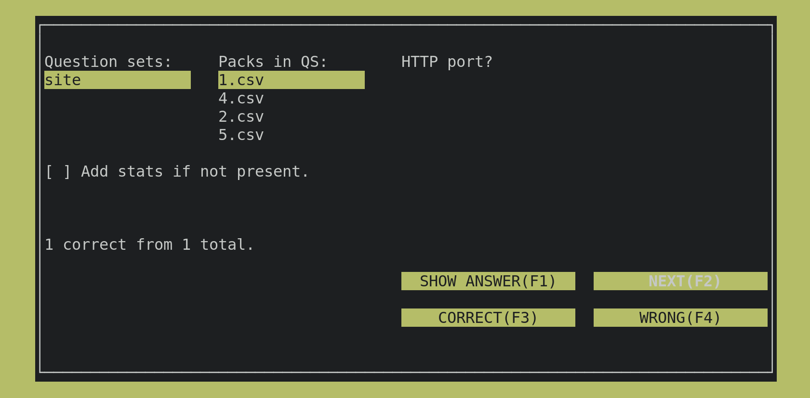

# Sphinx
software to practice active-recall questions.

## Note
When you run the app without any question-packs in question-sets, it crashes.
To fix it, add your own questions or use the submodule.
How to do it is specified in the following section.

## FAQ
### What is active-recall?
Method of learning based on recalling information from memory.
It's beneficial to your long-term memory and also more enjoyable than reading notes again and
again.

### How to use this method?
Study. Get/create question-packs. Practice questions. Sleep. Repeat.

### How to get Sphinx?
- clone the repo
```
git clone https://github.com/Yokto13/sphinx
```
- install requirements
```
pip install -r requirements.txt
```
- get questions (more on that in the following three questions)
- run 
``` 
python main_tui.py 
```

### How to create questions?
Right now the software expects csv files of the following format.

2 or 3 columns.

Comma is the delimeter.

The first row is a header that can contain pretty much anything 
but I use (Question, Answer, Stats).
On each row, there is a question, followed by an answer and optionally stats.

When you are creating question-pack just create a csv file with question-answer pairs.
Stats are generated automatically when the corresponding checkbox is ticked 
when using the Sphinx.

CSV files should be saved in question-sets directory. 
The structure of this directory is as follows 
```
question-sets/pack_about_some_course/file_with_questions_answers.csv
```
So when you want to add new questions first create directory in question-sets
with the name of your course for example and into this directory put the csv file
containing questions and answers.

There is a sample csv file to give you an idea how the csv file should be structured.

### Could you show the exact structure of the csv file?
Sure.
```
Question,Answer
How many roads must a man walk down before you call him a man?,42
How many seas must a white dove sail before she sleeps in the sand?,"The answer, my friend, is blowin' in the wind. The answer is blowin' in the wind."
```
or (when stats were generated):
```
Question,Answer,Stats
How many roads must a man walk down before you call him a man?,42,"score?|?|?1,2"
How many seas must a white dove sail before she sleeps in the sand?,"The answer, my friend, is blowin' in the wind. The answer is blowin' in the wind.","score?|?|?0,10"
```
Remember to enclose an element in quotes if it contains a comma.

### I don't want to create questions!
That's fine.
You can use some of the questions I have already created during my prep for exams.
Just call
```
git submodule init
git submodule update
```
and you are ready to go!
But be aware of the fact that the majority of questions there is in Czech 
and they are useful mainly for students of MFF CUNI.

### How to use Sphinx?
First select the question set and pack you want to use in the left upper part of the screen.
If statistics were never calculated for this pack, you can enable them otherwise they are 
used by default.
Use buttons in the right part of the screen to practice.

You can use arrows, tab and enter to navigate the screen.
It is also possible to use F1 etc to push some buttons.
There was a bug reported while using F-buttons on one device 
so they may not be working perfectly :(.
Mouse is also a good option and it works fine.

### Can I create/edit my own question-pack in the software?
Nope. I played with the idea but came to the conclusion that editing question-packs is 
easier to do with some editor already designed to work with csvs. 
I currently see it as reinventing the wheel.
But nonetheless, I may change my mind in the future.

### How stats work?
As of today, the Sphinx can store the number of correct/total attempts for each question.
If this is enabled it prioritizes questions with more wrong answers so you can practice them.

### I found a bug! What should I do?
Create an issue or if you feel like it fix it and do a PR. Thanks :)

## Screenshot


## Stoping the app
You can exit the app any time you want by pressing **CONTROL+C**. 
No worries, everything will be saved.
